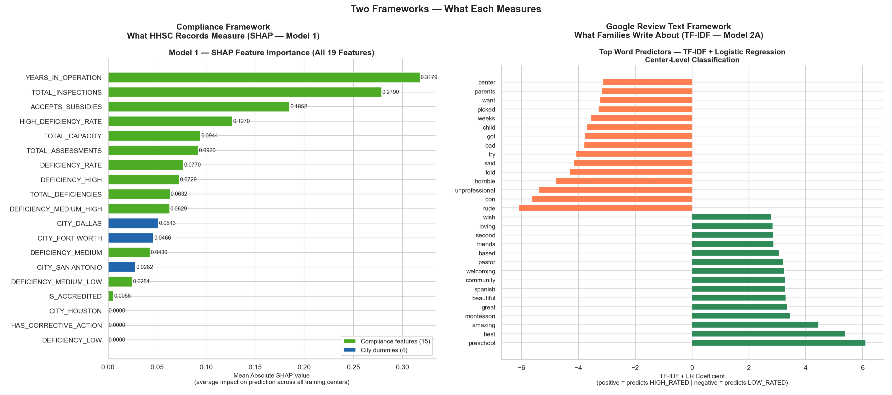
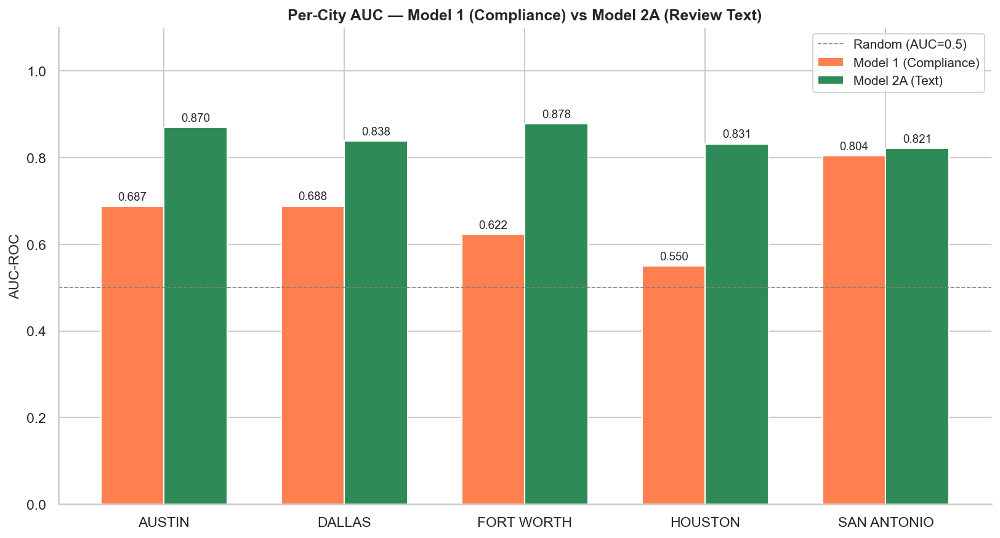
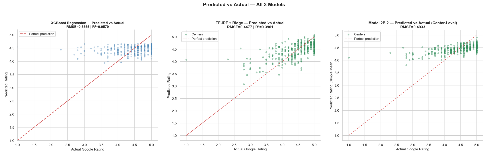
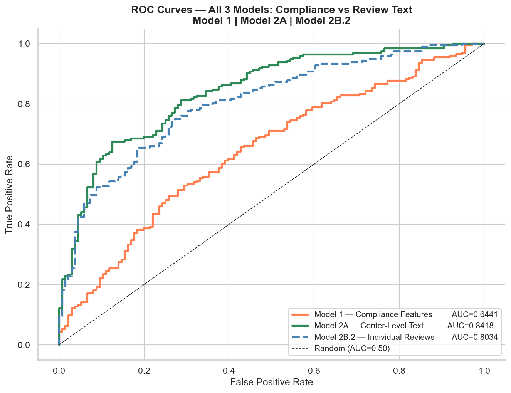

## Do Texas HHSC Compliance Records and Families' Google Reviews Agree on Which Daycare Centers Are High Quality — and Can a Parent Rely on Compliance Records Alone to Make an Informed Childcare Decision?

**Rakesh Chandrasekaran**

Professional Certificate in Machine Learning and Artificial Intelligence, UC Berkeley

Capstone Project | June 2026

---

> **TL;DR:** 1,697 active licensed daycares studied across Austin, Dallas, Fort Worth, Houston, and San Antonio. 7,550 Google review texts analyzed. Two models compared: one trained on TX government inspection records, one on what families actually wrote on Google reviews. The inspection model correctly identifies excellent centers 64% of the time. The review model gets it right 84% of the time. Review text explains 39% of why one center rates better than another; inspection records explain 6%. The finding that changed how I choose: I trusted Google reviews over a cleaner inspection record for our Austin daycare. The data confirmed it was the right call.

## Contents

- [Executive Summary](#executive-summary)
- [Rationale](#rationale)
- [Research Question](#research-question)
- [Data Sources](#data-sources)
- [Methodology](#methodology)
- [Results](#results)
  - [The Research Question Answered](#the-research-question-answered)
- [Recommendations](#recommendations)
- [Next Steps](#next-steps)
- [Outline of Project](#outline-of-project)
- [Disclaimer](#disclaimer)
- [Contact](#contact)

---

### Executive Summary

I am a parent in Austin. When my daughter was 14 months old, we started searching for a daycare.

Texas makes every licensed childcare center's inspection record public. I pulled them up. I also read every Google review I could find. And I noticed something: the two sources often disagreed. A center with a spotless inspection record could have parents writing about rude staff. A center with some violations could have parents describing a warm, loving environment their kids loved going to every morning.

I trusted the reviews. But I wanted to know if that was the right call or just intuition.

So I built models to find out.

**What I found**

The reviews were right to trust. A model trained on Texas daycare inspection records could only correctly identify excellent daycare centers 64% of the time which is barely better than a coin flip. A model trained on what families actually wrote in their Google reviews correctly identified excellent centers 84% of the time.

That gap of 20 percentage points is not a rounding error. It means that if you are a parent in Texas relying on the government's inspection data to pick a daycare, you are getting genuinely weak information. Reading even three or four reviews is a better use of your ten minutes.

**Key numbers**

- 1,697 active licensed daycares studied across Austin, Dallas, Fort Worth, Houston, and San Antonio
- 7,550 individual Google review texts analyzed
- TX HHSC Inspection records correctly identify excellent centers: 64% of the time
- Google Review text correctly identifies excellent centers: 84% of the time
- How much of a center's rating is explained by its inspection records: 6%
- How much is explained by what families write in their Google reviews: 39%

---

### Rationale

When we were searching for daycare in Austin, I went through the same process most parents do. I checked the HHSC inspection portal. I looked at star ratings. I read reviews. And the more I did this, the more I felt the inspection records and the reviews were telling me different stories about the same places.

At one point I was looking at two centers in our neighborhood. One had a cleaner inspection record. The other had a handful of violations but Google reviews from parents who clearly adored the place. Teachers remembered kids by name, families got updates during the day, and the director responded to every concern. We chose the second one.

That felt like the right call. But I could not say why with any rigor. As a management consultant, I spend my professional life helping organizations make better decisions with data. It felt wrong to make this one on gut feel alone. So I wanted to actually test it.

The project started as a personal question: which source should I trust? It ended up having implications beyond just my family. Texas spends public money on childcare inspections. If those inspections aren't telling parents what they need to know, that is worth understanding.

---

### Research Question

**Do Texas HHSC compliance records and families' Google reviews agree on which daycare centers are high quality — and can a parent rely on compliance records alone to make an informed childcare decision?**

---

### Data Sources

**Texas Government Inspection Records**

Texas Health and Human Services Commission (HHSC) publishes licensing records for every childcare facility in the state. This is public data, freely downloadable. For each center, it includes how many violations were found in each inspection and how severe they were, whether the center received formal corrective actions, how long it has been operating, its licensed capacity, and whether it accepts subsidized payments.

I used 15 data points from these records to build the inspection model.

**Google Reviews**

I matched each inspection record to its Google Places listing using the center's name and city. From Google I collected each center's aggregate star rating and up to five individual review texts. That gave me 7,550 reviews across 1,697 centers. Real sentences from real parents, not just star ratings.

Google star ratings are not a perfect measure of how good a center actually is. But they are the most direct, publicly available signal for how families felt about a center. That made them the right thing to predict.

---

### Methodology

I built two types of models and compared them head to head.

**Using inspection records**

The first model was trained using only what appears in the TX HHSC inspection database such as violations, history, capacity, operational details. This represents the best possible prediction that I could make from public government data, without reading a single review.

**Using what families wrote**

The second set of models used the actual words families wrote in their Google reviews. The technique converts words into patterns by figuring out which words and phrases consistently appear alongside high or low ratings. The model was trained and tested on the same held-out centers as the inspection model, so the comparison is direct.

I also tested a third approach: training on individual reviews rather than combining all reviews per center, to see if the finding held up across different ways of handling the data. It did.

**Making the comparison fair**

Both models were evaluated on centers they had never seen during training. I used two measures: how closely each model predicted the actual star rating, and how reliably each model ranked excellent centers above poor ones. Both measures told the same story.

---

### Results

#### The Research Question Answered

**Do Texas HHSC compliance records and families' Google reviews agree on which daycare centers are high quality — and can a parent rely on compliance records alone to make an informed childcare decision?**

No. The inspection records and the reviews are telling different stories.

When I used only inspection records to predict which centers families rated highly, the predictions were right about 64% of the time, which is barely better than a coin flip. When I used what families actually wrote in their Google reviews, the predictions were right 84% of the time. That gap held across every city in the study.

A parent checking only the inspection record before choosing a daycare is working with information that is far less reliable than what other families already wrote. Reading even two or three reviews gives a more accurate picture than anything in the TX HHSC database.

| Model | Identifies excellent centers | Average rating error | Explains rating differences |
|---|:---:|:---:|:---:|
| TX HHSC Compliance Records (Model 1) | **64%** | **±0.56 stars** | **6%** |
| Google Review Text — Center Level (Model 2A) | **84%** | **±0.45 stars** | **39%** |
| Google Review Text — Individual Reviews (Model 2B.2) | **80%** | **±0.49 stars** | **26%** |

The first column shows how often each model correctly identified which centers families actually rated as excellent. The second shows how far off the predicted star rating was on average. The third shows how much of the difference between centers each source can explain. A higher percentage means the source is telling me more about why one center is better than another.

**What I found in the TX HHSC inspection records**

I expected the inspection model to lean on violation counts and corrective actions. It did not. The most important factors turned out to be how long a center had been open, how many total inspections it had accumulated over its lifetime, and whether it accepted government subsidy payments. Those are proxies for age and demographics, not quality. The actual violations mattered less than I assumed they would. This helps explain why compliance records are such a weak predictor. The inspection framework is measuring operational history, not the quality of care families actually experience.

**What I found in the Google review text**

The words families use tell a completely different story. The words that most reliably predict a high-rated center are: love, amazing, wonderful, caring, staff, thank, happy, best. The words that most reliably predict a poorly rated center are: rude, unprofessional, horrible, worst. None of this vocabulary appears anywhere in an inspection report. Families write about how staff treat their children. Inspectors count violations. These are fundamentally different signals about a center's quality.



**The finding that changed how I think about this**

When I chose our Austin daycare, I went with the center that had better Google reviews even though its inspection record was not as clean. I could not explain that with data at the time. I just trusted the reviews more than the violations count.

The analysis confirmed it was the right call. Review text is a substantially stronger signal than inspection records across every city and every way I measured it. I did not expect the gap to be this large.

Houston was the most striking result. Compliance inspection records there are barely above random. A parent checking the TX HHSC data in Houston is getting almost no useful signal about center quality. The inspection framework there is especially disconnected from what families actually experience.

San Antonio showed the smallest gap. Compliance records perform relatively better there, though review text still wins. Why the cities differ is worth investigating further.



If I were searching for daycare again today, I would spend almost no time on the TX HHSC portal and considerably more time reading what families wrote, especially watching for the words "rude" and "unprofessional" which turned out to be the two strongest predictors of a poorly rated center across all models.

**Seeing the gap**

The scatter plots and ROC curves below show the gap visually. Each tells the same story from a different angle.



The left panel shows compliance predictions compressed into a flat band. The model cannot distinguish poor centers from excellent ones. The center and right panels show review text predictions tracking the diagonal, meaning the models actually distinguish quality levels across the full rating range.



The green curve (review text) lifts sharply toward the upper left corner. The orange curve (compliance records) barely rises above the diagonal. TX HHSC compliance inspection records are worth checking but they are far less reliable than what families actually wrote on Google reviews.

---

### Recommendations

**For parents**

1. Read the Google reviews first, before checking the TX HHSC inspection record. Even two or three reviews are more useful than a clean inspection record.
2. Watch for the words "rude" and "unprofessional" in reviews. These are the two strongest predictors of a poorly rated center across all models.
3. If a center has very few reviews, the inspection record is a weak positive signal but not enough to rely on alone.
4. If you are searching in Houston, be especially skeptical of inspection data. The analysis shows it is particularly unreliable there as a quality signal.

For what it is worth: I went with the center that had better reviews even when inspection records were mixed, and it was the right call.

**For compliance officers and policymakers**

1. The inspection framework is measuring operational history and violation counts. Families rate centers on staff relationships, warmth, and communication. These are measuring different things.
2. The words families use such as welcoming, rude, unprofessional, preschool have no counterpart in an inspection report. A redesign informed by what families actually write could close that gap.
3. Houston should be the highest priority. Compliance records there are barely above random as a quality signal.

**For daycare operators**

1. Staff behavior is the single strongest driver of low ratings. "Rude" and "unprofessional" are the top two negative predictors across all models. How staff treat families on difficult days matters more than anything in the inspection record.
2. Program identity and description matter. Centers described as preschools, Montessori programs, or community spaces consistently rate higher. That is about culture, not compliance.

---

### Next Steps

- **More reviews per center.**

    The Google Places API returns at most five reviews per center regardless of how many exist on Google. A center with hundreds of reviews on Google has only five captured in this analysis. Collecting the full review history using a bulk review data provider such as Outscraper would give the models substantially more signal and reduce the noise from the small sample. Adding reviews from other platforms such as Yelp would also test whether the compliance-vs-text finding holds across different review sources.

- **Expand beyond Texas.**

    The study covered Texas's five largest cities. Testing the finding in other states would show whether the compliance-vs-text gap is specific to Texas or a national pattern.

- **Deeper city analysis.**

    Houston diverged sharply from the other four cities. Understanding whether this reflects a different inspection culture, different family rating behavior, or something else entirely would sharpen the policy recommendations.

- **A tool for parents.**

    The models currently live in Jupyter notebooks. The natural next step is a simple tool where a parent enters a center's name and gets back a quality signal based on what other families wrote, without having to read dozens of reviews themselves.

---

### Outline of Project

#### Repository Layout

```
.
├── data/
│   ├── raw/                                     Raw API responses and source data
│   └── processed/
│       ├── model1_dataset.csv                   1,697 centers with 15 compliance features
│       ├── model2_reviews.csv                   7,550 individual Google review texts
│       ├── model1_outputs.pkl                   Model 1 predictions and metrics
│       ├── model2a_outputs.pkl                  Model 2A predictions and metrics
│       └── model2b_outputs.pkl                  Model 2B.2 predictions and metrics
├── 00-data-collection-preparation-eda.ipynb     Data collection, feature engineering, EDA
├── 01-model1-compliance-xgboost.ipynb           Model 1 — compliance features, SHAP analysis
├── 02-model2a-center-text.ipynb                 Model 2A — center-level aggregated review text
├── 03-model2b-individual-reviews.ipynb          Model 2B — individual reviews, center-aligned
├── 04-comparison-and-findings.ipynb             Cross-model comparison and final findings
├── images/
│   ├── eda/                                     Exploratory analysis plots
│   ├── models/                                  Model output plots (Notebooks 01-03)
│   └── comparison/                              Cross-model comparison plots (Notebook 04)
└── README.md
```

#### Notebooks

- [00 — Data Collection, Preparation and EDA](00-data-collection-preparation-eda.ipynb) — Data collection, matching centers to Google listings, feature engineering, exploratory analysis
- [01 — Model 1: Compliance Features](01-model1-compliance-xgboost.ipynb) — XGBoost regression and classification on 15 HHSC compliance features, SHAP analysis of what drives predictions
- [02 — Model 2A: Center-Level Text](02-model2a-center-text.ipynb) — TF-IDF + Ridge and Logistic Regression on center-level aggregated review text
- [03 — Model 2B: Individual Reviews](03-model2b-individual-reviews.ipynb) — TF-IDF models on individual reviews with center-aligned split, aggregated back to center level for comparison
- [04 — Cross-Model Comparison and Findings](04-comparison-and-findings.ipynb) — Full comparison across all three models, city-level analysis, what each framework actually measures, and the final answer to the research question

#### How to Run

- Run notebooks in order: 00 then 01 then 02 then 03 then 04. Each notebook saves outputs that the next one loads. Running out of order will fail.
- Data collection is pre-done. Notebook 00 calls the Google Places API which requires an API key. The raw data and processed datasets are included in `data/` so you can skip Notebook 00 and start from Notebook 01.
- Key libraries: pandas, numpy, scikit-learn, xgboost, shap, matplotlib, seaborn, rapidfuzz. Install all with `pip install -r requirements.txt`.

**Why data is included in this repo:** Notebook 00 collects data from the Google Places API and requires an API key. To ensure the analysis is fully reproducible without API credentials, the raw data and all processed datasets are committed to the repository.


---

### Disclaimer

This project was completed as a capstone submission for the UC Berkeley Professional Certificate in Machine Learning and Artificial Intelligence. It is an academic exercise, not professional childcare advice. This project is not affiliated with HHSC, Google, or any daycare center. The data used is publicly available and no endorsement of any platform is implied.

---

### Contact

Rakesh Chandrasekaran

Email: talk2rakeshc@gmail.com
